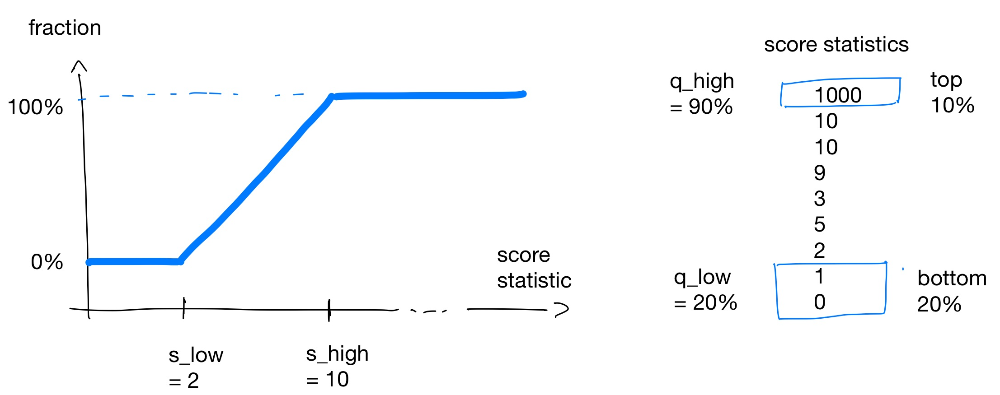

The final score of a validator is the sum of many individual scores that each measure how good a validator performs in a particular property. On this page, we take a 🤿 *deep dive* 🤿 into this score calculation...

 The 1kv programme is run by W3F and Parity. MathCrypto is not affiliated to either of those. The information available on this website was obtained from public sources and could contain errors. Feel free to [send us](https://www.math-crypto.com/staking/contact/) any errors or suggestions. 


## Outline

To understand the scoring system concretely, it is worthwhile to first understand how an individual score is calculated. They all follow the same three steps that [are explained below]().

Each of the individual scores are aligned with certain desired characteristics of a 1kv validator, for example, decentralization and a fair rotation of the 1kv nominators. The [most important scores are explained in detail next]().

A technical step in the scores is the transformation based on quantile data of all the validators. This is the [last explanation]().


## The calculation of an individual score {#calculation}


There are three steps to determine the score of a certain property of the validator:

- **Step 1**: Get oracle data about the **scored property**. Examples: 
  - Location (city) of the validator node as given by the 1kv telemetry.
  - Activity (inclusion in the active set) of the validator based on onchain data.
  - Democracy delegations of the validator from onchain data.

  *Remark*: Most oracles can be publicly verified (onchain data) but some are not (telemetry).

- **Step 2**: Express the scored property as a **score statistic**.
  Examples: 
  - Total number of nodes with the same location.
  - Total number of eras active in the last 28 eras.
  - Size (after transformation) of all delegated balances adjusted for conviction for this validator.

  *Remark*: Scores related to democracy properties undergo non-trivial transformations. See the [explanation below]() for examples.

- **Step 3**: Transform the score statistic to the **final score** for this property by taking into account how good the score statistic of this validator is compared to all other validators. 

  *Remark*: The exact transformation uses quantile data and is explained [further below]().


All steps are updated independently from each other. The typical frequency is a few times a day but it can be as slow as once a day. If the update of one step fails, then the corresponding score is *stale*. This can happen with one of the scores without affecting the others.


## Explanation of scored properties {#explanation}

To describe the score, we need the function ``transformQ`` that calculates a value between 0 and 1 how good a score statistic is, with 1 being the best. This is explained [further below]().

### 200 points: spanInclusion

The score ``spanInclusion`` expresses how many times the validator was active in the last 28 eras (7 days on Kusama and 28 days on Polkadot). This is also the score statistic, which is gathered by querying ``session.validators`` onchain.

By design of 1kv, validators that are active a lot need less help (that is, nominations by 1kv). This is thus a score of type *low-is-good*. 

Given the ideal situation of being nominated by 1kv and getting into the active set, this score will cycle from high to low and loose the 1kv nomination. The score will then gradually increase over time, and the pattern repeats itself.

*Remark*: Being active counts whether or not the validator was nominated by 1kv.

```
statistic = nb of active eras of this validator in the last 28 eras
score = (1 - transformQ(statistic, 0.25, 0.75)) * 200
```


### 200 points: inclusion

The score ``inclusion`` is the same as ``spanInclusion`` except that it uses an interval of the last 84 eras (21 days on Kusama and 84 days on Polkadot). Given this larger time window, it should be more robust to stale scores.

```
statistic = nb of active eras of this validator in the last 84 eras 
score = (1 - transformQ(statistic, 0.25, 0.75)) * 200
```

### 100 points: provider {#provider}

The score ``provider`` measures how uncommon the hosting company or internet provider of the validator node is, which is determined from telemetry data sent by the validator. Given the ip address of the validator, the information can be verified on [ipinfo.io](https://ipinfo.io), which uses the same database as the 1kv telemetry.

The score statistic is the total number of other 1kv validators with the same provider. If the provider is blacklisted (currently, Hetzner or Contabo), the final score is always zero and the validator is marked as invalid (and thus not eligible for 1kv nominations).

Since the 1kv programme promotes decentralization, a unique provider is preferable and this score statistic is of type *low-is-good*. 

```
statistic = nb of 1kv validators with the same provider as this validator
score = (1 - transformQ(statistic, 0.10, 0.95)) * 100
```


### 100 points: nominatorStake {#nominatorStake}

The ``nominatorStake``score takes into account the balances that are bonded to this validator node by all its nominators, active or inactive, excluding the 1kv nominators. This data is fetched onchain.

The statistic is the sum of the square root of each balance. This transformation favours smaller nominations which lessens the sometimes lucky impact of securing a bigger nominator.

Since attracting nominations outside 1kv is the prime purpose of running a validator, this score is of type *high-is-good*.

```
statistic = sum_{n is nominator except 1kv} sqrt(balance of n bonded to this validator)
score = transformQ(statistic, 0.10, 0.95) * 100
```

### 100 points: openGov

Diligently voting on openGov referenda is measured by the ``openGov`` score. The votes of the validator node are fetched onchain. Votes casted directly by the validator node or votes delegated to a different account (that actually voted on a referendum) count as valid votes. The balance, conviction, and direction (Aye, Nay, Split, Abstain) are not taken into account for the score.

The score statistic is a rather complicated calculation to promote consistent voting in long streaks but also favour voting on recent referenda; see the function ``scoreDemocracyVotes`` in the [source code](https://github.com/w3f/1k-validators-be/blob/master/packages/common/src/score.ts) for details. The statistic is of type *high-is-good*. 

Regardless of the exact implementation for the score statistic, if the validator votes on every referendum, its final score will rise to the maximum value gradually over time..

```
statistic = measure consistency and recency of the openGov voting pattern of this validator
score = transformQ(statistic, 0.25, 0.75) * 100
```

### 100 points: openGovDelegation 

*Warning: The implementation of this score is more complicated than the other scores since there is no simple query for it onchain. The following information is based on our reading of the source code and could contain errors.*

OpenGov allows delegation of voting to separate referenda tracks. The 1kv programme therefore incentives validators to attract such OpenGov delegations (to one or more referenda tracks) with the ``openGovDelegation`` score.

The score depends on all the OpenGov delegations that point to a validator *and* to all addresses that are associated to that validator by onchain identities (either as a main or a sub-identity). It excludes delegations that come from any of these addresses (that is, self-delegations). The balances of the delegations are then adjusted for conviction (with 6x conviction leading to the highest balance but also the longest lock-up). Finally, the total size of the delegation is calculated per referendum track and per address by summing the square root of the adjusted balances (like in [``nominatorStake``]()). We thus end up with many score statistics and the final score statistic is simply the largest of all these. 

A typical situation is that a validator node is a sub-identity of the team's main identity. When the main identity has the largest delegation (in total transformed balance as explained above) for a certain referendum track, the validator node will get an ``openGovDelegation`` score based on that largest delegation.

```
N = set of all addresses with same sub-id or main id as this validator
statistic = max_{a in N, t is ref. track} 
              sum_{d is address that delegated to a for t and not in N} 
                 sqrt(conviction adjusted delegated balance of d)
score = transformQ(statistic, 0.10, 0.60) * 100
```


### 50 points: bonded

A validator can bond a certain amount of tokens to itself. This amount is the score statistic of the ``bonded`` score. This information is onchain.

Obviously, this is a  *high-is-good* score since high bonded amounts show that the validator has skin-in-the-game given the risk of being slashed.


```
statistic = balance bonded to this validator
score = transformQ(statistic, 0.05, 0.85) * 100
```


### 40 points: location

This score is similar to [``provider``]() except that it uses the location of the ip address. The information is also given by the 1kv telemetry based on the [ipinfo.io](https://ipinfo.io) database.

If the provider of the validator node is blacklisted, this score will be zero.

```
statistic = nb of 1kv validators with the same location as this validator
score = (1 - transformQ(statistic, 0.10, 0.95)) * 100
```


### 30 points: nominated

To give all validators a fair chance, the 1kv nominations should rotate sufficiently frequently. The score ``nominated`` expresses how long ago the last nomination by 1kv was for this validator node.

The score statistic is the time (in seconds since the [Unix epoch](https://en.wikipedia.org/wiki/Unix_time)) since the last 1kv nomination. A recent nomination (larger time stamp) makes you less good of a candidate for renomination. This is thus a *low-is-good* score.


```
statistic = unix timestamp since last 1kv nomination for this validator
score = (1-transformQ(statistic, 0.25, 0.75)) * 100
```


### Scores that will be phased out in time

Scores related to the old democracy pallet (Gov1) used to be important before the implementation of openGov. These scores with their maximal points are as follows.
- ``delegations`` (max 60): Amount of Gov1 delegations (adjusted for conviction).
- ``democracy`` (max 30): Consistency in voting at Gov1 referenda.
- ``council`` (max) 10): Bonded amount for Gov1 council elections	


Since Gov1 is no longer active on Kusama (and will be phased on Polkadot), it is less interesting and even pointless to spend energy on these scores. Furthermore, it is expected that the maximal values will decrease in time, as has already happened before.

### Less important scores

The remaining scores ``region``, ``country``, ``discovered``, ``rank``, ``faults``, ``offline`` all have less than 10 points each. Since they account in total for maximum 32 points out of the full 1057 points in the 1kv score, they can safely be neglected in the interest of maximizing your score.  

## Scoring based on quantile data {#quantile}

Each score of a validator is calculated based on how good its corresponding score statistic is *in relation to those of the other validators*. This calculation is somewhat close to how grades on a percentile scale from 0% to 100% are determined for a test in school.

Taking ``bonded`` as an example since it has a simple score statistic--the amount of tokens--how should we "grade" a bonded amount of 5 KSM? The answer is that it depends on how "good" 5 KSM is. Suppose the maximum amount bonded of all 1kv validators is 10 KSM and the minimum is 0 KSM. Then our validator of 5 KSM is right in the middle and it is reasonable to give it 50% of the maximal score. Similarly, 10 KSM gets you the maximal score and 0 KSM a zero score. 

Our example above can be generalized by means of linear interpolation. Concretely, let ``s_low`` and ``s_high`` be the minimal and maximal score statistics, respectively, then the score of ``statistic`` is calculated as
```
fraction = (statistic - s_low) / (s_high - s_low)
score = fraction * max_score.
```

The procedure above has a problem with *outliers*: suppose there is one validator with a very large bond of, say, 1000 KSM. They will get 100% of the score whereas everyone else will basically have zero score (actually, at most ``0.001 * max_score``). Whether this is fair is debatable but in 1kv such outliers are filtered out. All values bigger than a certain percentile ``q_high`` get mapped to the maximal score. For example, using the 90% percentile and 100 validators, the validators with the best 10 score statistics will all get maximal scores. Their score statistics are then removed from the original set and we proceed like above. (Observe that this changes the original value of ``s_high``.) A similar procedure is done for the minimal value where all score statistics lower than  the ``q_low`` percentile are mapped to zero points and removed.

We thus end up with a function ``transfromQ(statistic, q_low, q_high)`` that gives us the "percentile grade" of the score of a validator with ``statistic``. In a graph, this looks as follows:



This continues with the ``bonded`` example from above where you also need at least 2 KSM to have non-zero score and 8 KSM is enough to get a full score. These numbers where determined from the percentiles ``q_low = 20%`` and ``q_high = 90%`` on the given list of 10 score statistics.

There is one last twist. The explanation above is for score statistics where high values are good. For a *low-is-good* statistic, we simply take ``1-transfromQ(statistic, q_low, q_high)`` to flip the roles of 0% and 100%.


## Tips
- **Find a location where the provider has a unique location, country, and provider company.** You can check this on [ipinfo.io](https://ipinfo.io) given the ip address of you node. If the location (city) is wrong, you can [ask for a correction](https://ipinfo.io/corrections).
- **Do not miss voting on referenda!** If you do not find the time, delegate your votes to someone you trust. This can be done in with the [Delegation Dashboard](https://delegation.polkadot.network/) or, if you want more precise control, with [our own tool](https://backend-opengov.math-crypto.com/).


## References

- [Calculations of score from score statistic](https://github.com/w3f/1k-validators-be/blob/master/packages/common/src/constraints.ts)
- [Helper functions for calculating the score statistic](https://github.com/w3f/1k-validators-be/blob/master/packages/common/src/score.ts)
- [Maximum values of the scores](https://github.com/w3f/1k-validators-be/tree/master/apps/1kv-backend/config)